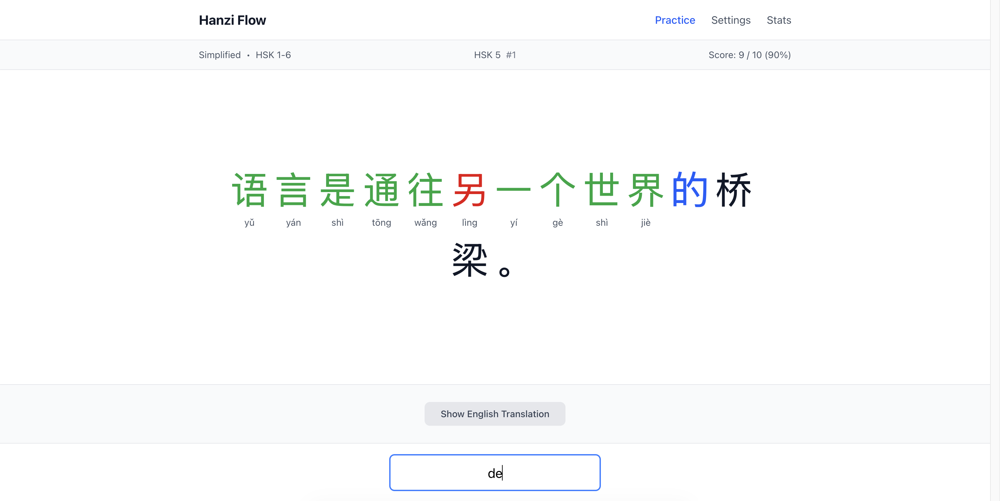

# Hanzi Flow

**Master Chinese Reading with HSK 3.0-Aligned Adaptive Practice**

A privacy-first, local-first web application for learning Chinese characters through contextual sentence practice. Uses an adaptive algorithm to select sentences based on your mastery level, with support for both Simplified and Traditional Chinese.

*Character-by-character sentence practice with real-time feedback*

## ✨ Key Features

- 🎯 **HSK 3.0 Aligned** - Complete coverage of HSK levels 1-9 (3,000+ characters), 79,000+ sentences
- 🧠 **Adaptive Learning** - NSS algorithm picks optimal sentences based on your mastery level
- 🔒 **100% Private** - All data stored in browser (IndexedDB), no backend, no tracking, works offline
- 🌐 **Flexible Scripts** - Simplified or Traditional scripts both supported
- 📊 **Progress Tracking** - Character-level mastery scores, visual stats dashboard, spaced repetition
- 🔊 **Audio Support** - Native speaker audio for all pinyin syllables

## 🚀 Quick Start

**For users**: Visit [hanziflow.vercel.app](https://hanziflow.vercel.app) to start practicing immediately.

**For developers**: See [docs/DEVELOPER_GUIDE.md](docs/DEVELOPER_GUIDE.md) for setup instructions, development workflows, and data pipeline documentation.

## 📚 Documentation

Comprehensive documentation is available in the [`docs/`](docs/) directory, including:
- Vision and architecture
- Development workflows and setup
- Data pipeline documentation
- Feature roadmap
- Technical insights and debugging tips

**Start here:** [`docs/PROJECT_BRIEF.md`](docs/PROJECT_BRIEF.md) for an overview with links to all other documentation.

## 🛠️ Tech Stack

Next.js 15 + React 19 + TypeScript + Tailwind CSS + IndexedDB | Python data pipelines (pypinyin, jieba) | Vercel deployment

See [docs/TECHNICAL_OVERVIEW.md](docs/TECHNICAL_OVERVIEW.md) for architecture details.

## 📊 Data Sources

This project builds upon excellent open-source datasets:

- **Sentences**: [Tatoeba](https://tatoeba.org/) (CC BY 2.0 FR) - 79,704 Chinese-English sentence pairs
- **Dictionary**: [CC-CEDICT](https://cc-cedict.org/) (CC BY-SA 4.0) - Chinese-English dictionary
- **HSK Classification**: [elkmovie/hsk30](https://github.com/elkmovie/hsk30) (MIT) - Official HSK 3.0 character lists
- **Audio**: Generated using AWS Polly (Zhiyu voice)

All processed data is included in this repository under compatible licenses.

## 🤝 Contributing

Hanzi Flow is an open-source Chinese learning platform built with extensibility and community collaboration in mind. Contributions, feature requests, and bug reports are welcome!

## 📄 License

MIT License - see [LICENSE](LICENSE) for details.
